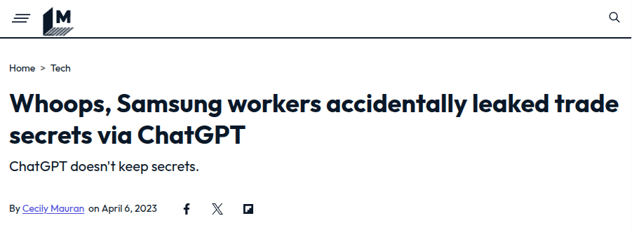

Artificial Intelligence (AI) has fundamentally transformed how we access and interact with information. From the advent of Google Search to the conversational capabilities of ChatGPT, these tools have made public knowledge more accessible than ever. However, their utility is limited when it comes to managing private, confidential data—a challenge that organizations must address to unlock the full potential of AI. This limitation has become increasingly apparent as the volume of digital content and the complexity of queries have grown exponentially in recent years.

## The Evolution of Information Retrieval

Historically, accessing knowledge required significant effort, from physical travel in ancient times to the invention of the printing press, which revolutionized how information was stored and shared. The digital age brought another leap with Google Search, placing vast amounts of public knowledge at our fingertips. This shift from physical to digital information retrieval emerged with the introduction of computers in the mid-20th century, with the first instances of computer-based searching systems appearing in the 1940s.

More recently, ChatGPT introduced a paradigm shift by enabling conversational interactions with information, offering synthesized insights and maintaining context across queries. This advancement is part of a broader trend in AI-powered information retrieval, which uses machine learning and natural language processing to learn and improve over time with more data and user interactions.

Despite these advancements, one glaring limitation remains: these tools excel in handling public data but falter when applied to private or sensitive information. This challenge has become particularly acute as organizations seek to leverage AI for efficiency while maintaining data privacy and security.

## The Problem: AI and Confidential Data

While organizations increasingly rely on AI for efficiency, using public AI tools for private data poses significant risks. A cautionary tale comes from Samsung, where employees inadvertently leaked sensitive trade secrets to ChatGPT. This incident underscores the dangers of using external AI platforms for confidential data and highlights the need for secure, localized AI solutions.

The key question is: **Why can't we use AI to interact securely with private data?** This question has driven recent innovations in AI-powered private knowledge management systems, which aim to provide the benefits of AI-driven information retrieval while maintaining data privacy and security.

## The Solution: Private AI-Powered Knowledge Management

Organizations can overcome this challenge by building localized, AI-powered knowledge management systems. Using open-source tools such as n8n (workflow automation), Ollama (LLM platform), and Qdrant (vector store), it's now possible to create secure, self-hosted AI chatbots tailored for proprietary data. This approach represents a significant evolution in enterprise information retrieval, moving beyond traditional SQL and NoSQL databases to more advanced, AI-driven solutions.

## How It Works: The n8n Workflow

### Data Ingestion & Indexing

My n8n workflow consists of two parts. The first step is to build a knowledge base using private data. In my scenario, I use a privately hosted Seafile server as a data store where I upload my private files. The n8n workflow searches for files in a specific folder, downloads them, and passes them to the indexing step. Instead of using the Llama LLM, I opted for Nomic-Embed-Text because it is specialized for text recognition.

At the end of this process, I move the files to another folder to prevent them from being indexed again during the next workflow run in n8n.

To summarize—or to be more technical—you could describe this process as "data ingestion & indexing," where documents are read and preprocessed. The content is then converted into embeddings and stored in a vector database like Qdrant.

### Retrieval-Augmented Generation (RAG)

Once the knowledge base is prepared, it’s time to leverage n8n’s capabilities to build my own AI-powered chatbot. I use the Llama LLM to interpret user questions. The AI agent then retrieves the relevant context from the vector database, and the chatbot uses this context to generate informed responses.

This approach ensures 100% data privacy by keeping everything local while leveraging AI's power for enhanced information retrieval and analysis. It combines the strengths of machine learning algorithms, natural language processing, and vector search to provide more accurate and contextually relevant results.

To ensure that my AI setup does not invent new content, I tested the chatbot with an empty vector store. This was done to confirm that no external knowledge is used. As shown in the result below, the chatbot correctly responds with "I don't know."

Now it’s time to upload some files to Seafile and execute the workflow to send this information to the vector store. For this demonstration, I exported some of our help documentation from SeaTable into PDF files and uploaded them to Seafile.

Finally, I asked my first question to verify whether the AI uses the knowledge correctly. Interestingly, although I uploaded German texts, the AI model was able to interpret my question correctly and respond in English.

What an awesome feeling!

## Potential Use Cases

You might now see, that AI-powered knowledge management systems have diverse applications across industries:

- **Medical Practices**: Quickly retrieve patient histories or suggest alternative treatments.
- **Universities**: Identify synergies between research projects.
- **Software Companies**: Analyze support requests to improve documentation.

These use cases demonstrate the potential of AI to revolutionize information retrieval across various sectors, enhancing decision-making and operational efficiency.

## Challenges and Future Outlook

While promising, this approach isn't without challenges:

- **Data Privacy**: Ensuring all operations remain local.
- **Accuracy**: Carefully curating the knowledge base.
- **Scalability**: Efficiently managing large datasets.
- **AI Hallucinations**: Preventing the generation of false information.

Looking ahead, localized AI systems will likely become standard in corporate environments. Employees will interact with company-specific knowledge through chatbots, enhancing productivity and decision-making. This shift represents a significant evolution in knowledge management, moving towards what some experts call the "7R Model of AI Evolution," which includes stages like Retrieval, Regression, and Recognition.

## Summary

The tools and frameworks for building these systems are readily available. Explore the [Self-Hosted AI Starter Kit on GitHub](https://github.com/n8n-io/self-hosted-ai-starter-kit) to start experimenting today. By embracing this technology, organizations can revolutionize how they manage and access their proprietary knowledge securely.

As we move forward, the evolution of AI in information retrieval continues to accelerate. From the early days of keyword-based search to today's advanced semantic search capabilities, AI is transforming how we interact with and extract value from information. The future promises even more sophisticated AI-driven information retrieval systems, potentially leading to what some researchers envision as General Super Intelligence (GSI).

Let's shape the future of private knowledge management together, leveraging the power of AI while maintaining the security and privacy of our most valuable data assets!
